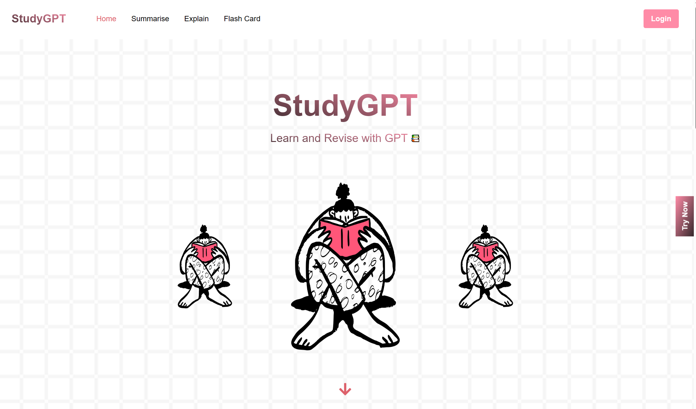

<h2 align="center"><b>StudyGPT</b></h2>

<p align="center">

</p>

<h4 align="center">
  <b>Your Powerful All-In-One Learning Companion Powered by ChatGPT</b>
  <br /><br />
  <a href="https://lifehack-23.devpost.com/">LifeHack 2023</a>
</h4>

<p align="center">
<a href="https://github.com/xJQx/study-gpt/blob/master/LICENSE" target="blank">

</a>
<a href="https://github.com/xJQx/study-gpt/fork" target="blank">

</a>
<a href="https://github.com/xJQx/study-gpt/stargazers" target="blank">

</a>
<a href="https://github.com/xJQx/study-gpt/issues" target="blank">

</a>
<a href="https://github.com/xJQx/study-gpt/pulls" target="blank">

</a>
</p>

<p align="center">
    <a href="https://study-gpt.vercel.app/">View Demo</a>
    ·
    <a href="https://github.com/xJQx/study-gpt/issues/new/choose">Report Bug</a>
    ·
    <a href="https://github.com/xJQx/study-gpt/issues/new/choose">Request Feature</a>
</p>

## 👋🏻 Introducing `StudyGPT`

<p align="center">
    <a href="https://study-gpt.vercel.app/" target="_blank">
        
    </a>
</p>

Looking to take your learning to the next level? Introducing our Powerful All-In-One Learning Companion, `StudyGPT`! Packed with powerful features, it's designed to simplify your learning journey and maximize your potential.

Get ready to supercharge your learning journey with our powerful companion. Seamlessly log in, access concise summaries, clarify doubts at your convenience, and reinforce knowledge with personalized flashcards. Experience the future of learning - try it today!

<br />

## 🚀 Demo

Here is a quick demo of the app. We hope you enjoy it.

> [Website Demo Link](https://study-gpt.vercel.app/)
>
> [YouTube Demo Link](https://youtu.be/hL6o276WFLU)

Liked it? Please give a ⭐️ to **StudyGPT**.

<br />

## 🔥 Features

`StudyGPT` comes with 4 key features:

#### Feature 1: Google Authentication

Login seamlessly with your Google account for quick and secure access. Experience the perfect balance of convenience and top-notch security.

#### Feature 2: Summariser

Unlock the essence of complex concepts effortlessly. Our summarization feature condenses lengthy and abstract notes into sleek summaries, giving you a sneak peek into the bigger picture.

#### Feature 3: Explainer

No more doubts holding you back! Our interactive platform provides instant, intelligent responses to your queries, empowering you to clarify new concepts whenever you need.

#### Feature 4: Flashcard Generator

Retain knowledge for the long term and elevate your learning. Craft personalized flashcards based on your own notes, reinforcing your understanding of the concepts you've learned.

<br />

## 💪🏻 Try Yourself

1. Get a copy of this repository by opening up your terminal and run:

```bash
git clone https://github.com/xJQx/study-gpt.git
```

2. Install dependencies

```bash
npm run install
```

3. Set up Environment Variables

Create a `.env` file in the root directory with all the environment variables listed in the `.env.example`.

```env
# .env file with all your environment variables

OPEN_AI_API_KEY=

# Firebase
NEXT_PUBLIC_API_KEY= 
NEXT_PUBLIC_AUTH_DOMAIN= 
NEXT_PUBLIC_PROJECT_ID= 
NEXT_PUBLIC_STORAGE_BUCKET= 
NEXT_PUBLIC_MESSAGING_SENDER_ID= 
NEXT_PUBLIC_APP_ID= 
NEXT_PUBLIC_DATABASE_URL= 

# Firebase google authentication
WEB_CLIENT_ID=
WEB_CLIENT_SECRET=
```

4. Start up the application

```bash
npm run dev
```

5. Open http://localhost:3000/ in your browser, login, and enter your OpenAI API Key

<br />

Congratulations, you have successfully created your own copy of StudyGPT.

<br />

## 🏗️ Tech Stack


<br />

## ✨ Contributors

<a href='https://github.com/xJQx' title='Jing Qiang'> </a>
<a href='https://github.com/DemonDia' title='Siang Meng'> </a>
<a href='https://github.com/tantzeyeong' title='Tze Yeong'> </a>
<a href='https://github.com/yantattan' title='Yan Tat'> </a>

<br />

## 💡 Contributing

Have an idea or improvement to make? Create an issue and make a pull request!
